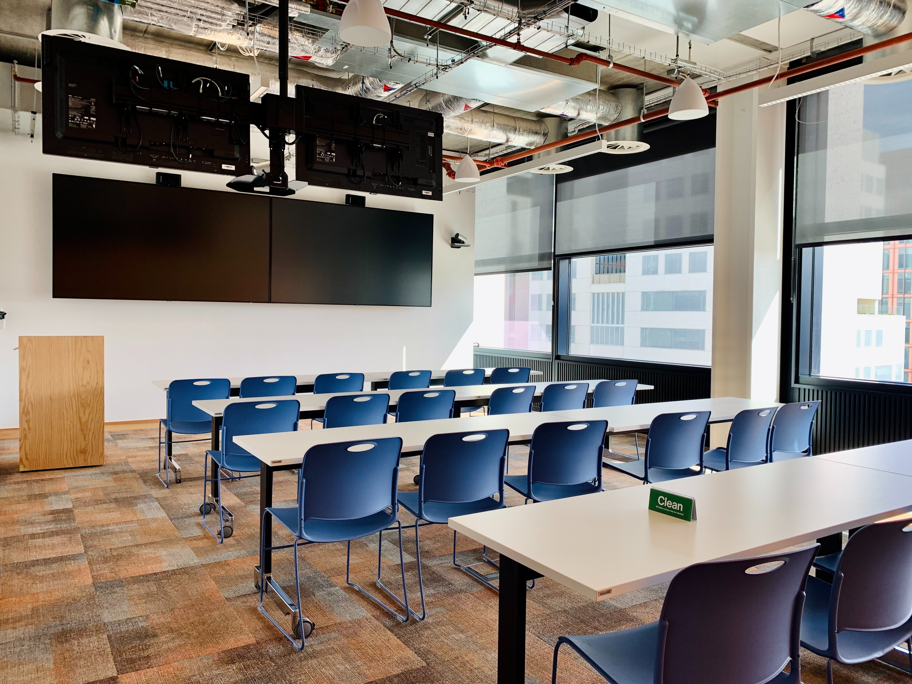
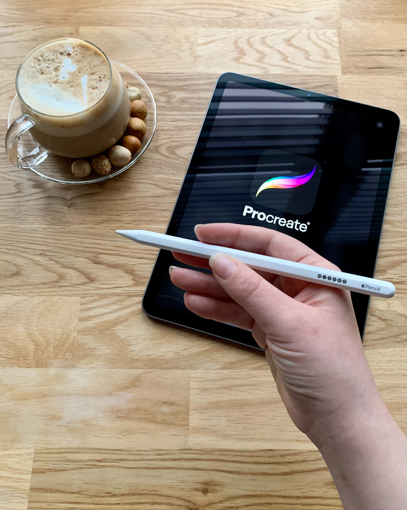

Curriculum
Short Specializations
Average: 102.4%
Flexbox
HTML
CSS
Front-end
 By: David Dias, Senior Software Engineer at HomeX
 Weight: 1
 Project will start May 8, 2023 6:00 AM, must end by May 15, 2023 6:00 AM
 Checker will be released at May 10, 2023 12:00 AM
 Manual QA review must be done (request it when you are done with the project)
 An auto review will be launched at the deadline

Resources
Read or watch:

A Complete Guide to Flexbox | CSS-Tricks
Flexbox Froggy - A game for learning CSS flexbox
Flexbox Defense
Flexbox Cheatsheet
CSS Flexible Box Layout - CSS: Cascading Style Sheets | MDN
afonsopacifer/awesome-flexbox: A curated list of CSS Flexible Box Layout Module or only Flexbox.
Build with Flexbox
Flexplorer
CSS Flexible Box Layout Module Level 1
FLEX: A simple visual cheatsheet for flexbox
Learning Objectives
At the end of this project, you are expected to be able to explain to anyone, without the help of Google:

What is Flexbox?
How to convert float positioning to a flex display
How to horizontally and vertically align elements using Flexbox
The difference between the main and cross axes
Properties that work on flex elements vs flex container
Shorthands for flex
How to create a new page with flex in mind
Requirements
Allowed editors: vi, vim, emacs
A README.md at the root of the project directory is mandatory
All of your code will be executed on Ubuntu 18.04 using Python 3.7.x
All of your files should end with a new line
Files
Required images for your HTML files
Download the images linked in the CSS Advanced project and place them into an images directory at the root of the project.

HTML starter file
<!DOCTYPE html>
<html lang="en" dir="ltr">
  <head>
    <meta charset="utf-8">
    <meta name="viewport" content="width=device-width, initial-scale=1, viewport-fit=cover">
    <title>Homepage - Techium</title>
    <meta name="description" content="Description of the page less than 150 characters">
    <link rel="icon" type="image/png" href="images/favicon.jpg">
    <link href="https://fonts.googleapis.com/css?family=Open+Sans:400,700|Raleway:700&display=swap" rel="stylesheet">
    <link rel='stylesheet' href='styles.css'>
  </head>
  <body>
    <!– Header –>
    <header class="header" data-section-theme="dark">
      

        

          
        

        <nav class="navbar-menu">
          <ul class="nav">
            <li class="nav-item">
              <a href="#" class="nav-link">Home</a>
            </li>
            <li class="nav-item">
              <a href="#services" class="nav-link">Services</a>
            </li>
            <li class="nav-item">
              <a href="#works" class="nav-link">Works</a>
            </li>
            <li class="nav-item">
              <a href="#about" class="nav-link">About</a>
            </li>
            <li class="nav-item">
              <a href="#latest_news" class="nav-link">Latest news</a>
            </li>
            <li class="nav-item">
              <a href="#testimonials" class="nav-link">Testimonials</a>
            </li>
            <li class="nav-item">
              <a href="#contact" class="nav-link">Contact</a>
            </li>
          </ul>
        </nav>
      

    </header>
    <!– Main –>
    <main>
      <!– Hero section –>
      <section class="section-hero" data-section-theme="dark">
        

          

            <section class="section-inner">
              <h2 class="section-title">We help you build your brand</h2>
              <a href="#" class="button">Get Started</a>
            </section>
          

        

      </section>
      <!– Services section –>
      <section id="services" class="section">
        

          <header class="section-header">
            <h2 class="section-title">Services</h2>
            
We work with you

          </header>
          

            <ul class="row">
              <li class="col-1-3">
                

                  <h3 class="card-title"><a href="#">Design & Concept</a></h3>
                

              </li>
              <li class="col-1-3">
                

                  <h3 class="card-title"><a href="#">Digital Strategy</a></h3>
                

              </li>
              <li class="col-1-3">
                

                  <h3 class="card-title"><a href="#">Content Strategy</a></h3>
                

              </li>
            </ul>
            <ul class="row">
              <li class="col-1-3">
                

                  <h3 class="card-title"><a href="#">UX Design</a></h3>
                

              </li>
              <li class="col-1-3">
                

                  <h3 class="card-title"><a href="#">Web Development</a></h3>
                

              </li>
              <li class="col-1-3">
                

                  <h3 class="card-title"><a href="#">Social Media</a></h3>
                

              </li>
            </ul>
          

        

      </section>
      <!– Works section –>
      <section id="works" class="section" data-section-theme="dark">
        

          <header class="section-header">
            <h2 class="section-title">Works</h2>
            
Take a look at our portfolio

          </header>
          

            <ul class="row">
              <li class="col-1-3">
                <article class="card-work">
                  

                    

                      
                    

                    

                      <h3 class="card-title"><a href="#">Interior Design</a></h3>
                    

                  

                </article>
              </li>
              <li class="col-1-3">
                <article class="card-work">
                  

                    

                      
                    

                    

                      <h3 class="card-title"><a href="#">Web Development</a></h3>
                    

                  

                </article>
              </li>
              <li class="col-1-3">
                <article class="card-work">
                  

                    

                      
                    

                    

                      <h3 class="card-title"><a href="#">Personal Development</a></h3>
                    

                  

                </article>
              </li>
            </ul>
          

        

      </section>
      <!– About Us section –>
      <section id="about" class="section">
        

          <header class="section-header">
            <h2 class="section-title">About Us</h2>
            
Everything about us

          </header>
          

            

              

                
              

              

                <h3>Who are we</h3>
                
Lorem ipsum dolor sit amet, consectetur adipisicing elit. Ipsum, omnis expedita! Eum, praesentium cumque accusantium rem, sit quaerat est nisi ratione, deserunt ducimus quidem iste dicta quibusdam atque maxime cum!

                <h3>Our culture</h3>
                
Lorem ipsum dolor sit amet, consectetur adipisicing elit. Ipsum, omnis expedita! Eum, praesentium cumque accusantium rem, sit quaerat est nisi ratione, deserunt ducimus quidem iste dicta quibusdam atque maxime cum!

                <h3>How we work</h3>
                
Lorem ipsum dolor sit amet, consectetur adipisicing elit. Ipsum, omnis expedita! Eum, praesentium cumque accusantium rem, sit quaerat est nisi ratione, deserunt ducimus quidem iste dicta quibusdam atque maxime cum!

              

            

          

          

            <a href="#" class="button">Learn more about us</a>
          

        

      </section>
      <!– Latest news section –>
      <section id="latest_news" class="section">
        

          <header class="section-header">
            <h2 class="section-title">Latest News</h2>
          </header>
          

            <ul class="row">
              <li class="col-1-3">
                <article class="card-blog">
                  

                    
                  

                  
Career

                  <h3><a href="#">Hoc loco tenere se Triarius non potuit.</a></h3>
                  
Lorem ipsum dolor sit amet, consectetur adipiscing elit. Id Sextilius factum negabat. Quo tandem modo? At eum nihili facit; Quae contraria sunt his, malane?

                  <small>By Kelly D.</small>
                </article>
              </li>
              <li class="col-1-3">
                <article class="card-blog">
                  

                    
                  

                  
Digital Life

                  <h3><a href="#">Ut alios omittam, hunc appello, quem ille unum secutus est.</a></h3>
                  
Lorem ipsum dolor sit amet, consectetur adipiscing elit. Tum mihi Piso: Quid ergo? Tum ille: Ain tandem? Non autem hoc: igitur ne illud quidem. Sed quod proximum fuit non vidit. Nos commodius agimus. An nisi populari fama?

                  <small>By William A.</small>
                </article>
              </li>
              <li class="col-1-3">
                <article class="card-blog">
                  

                    
                  

                  
Social

                  <h3><a href="#">Bestiarum vero nullum iudicium puto.</a></h3>
                  
Lorem ipsum dolor sit amet, consectetur adipiscing elit. Non igitur bene. Quid enim est a Chrysippo praetermissum in Stoicis? Pugnant Stoici cum Peripateticis. Prioris generis est docilitas, memoria; Apparet statim, quae sint officia, quae actiones.

                  <small>By Frances J.</small>
                </article>
              </li>
            </ul>
          

        

      </section>
      <!– Testimonials section –>
      <section id="testimonial" class="section">
        

          <header class="section-header">
            <h2 class="section-title">Testimonials</h2>
            
We are more than a digital company

          </header>
          

            <ul class="row">
              <li class="col-1-3">
                <article class="card-testimonial">
                  
                  <blockquote class="card-quote">
                    
I am completely blown away. Thanks to Techium, we’ve just launched our 5th website!
                      <cite>Yuri Y.</cite>
                    

                  </blockquote>
                </article>
              </li>
              <li class="col-1-3">
                <article class="card-testimonial">
                  
                  <blockquote class="card-quote">
                    
Thank you so much for your help. Techium company is awesome!
                      <cite>Dorrie S.</cite>
                    

                  </blockquote>
                </article>
              </li>
              <li class="col-1-3">
                <article class="card-testimonial">
                  
                  <blockquote class="card-quote">
                    
I love your system. Definitely worth the investment. I’d be lost without Techium company.
                      <cite>Sven H.</cite>
                    

                  </blockquote>
                </article>
              </li>
            </ul>
          

        

      </section>
      <!– Contact section –>
      <section id="contact" class="section">
        

          <header class="section-header">
            <h2 class="section-title">Contact</h2>
            
We’d love to hear from you!

          </header>
          

            
Lorem ipsum dolor sit amet, consectetur adipiscing elit. Id Sextilius factum negabat. Quo tandem modo? At eum nihili facit; Quae contraria sunt his, malane?

          

          

            <a href="#" class="button">Get in touch</a>
          

        

      </section>
    </main>
    <!– Footer –>
    <footer class="footer" data-section-theme="dark">
      

        

          

            
            <address class="footer-address">
              972 Mission St 
              San Francisco, CA 
              94103
            </address>
          

          

            <ul class="social nav">
              <li class="social-item nav-item">
                <a href="https://www.facebook.com/HolbertonSchool/" class="social-link">
                  <svg viewbox="0 0 24 24" xmlns="http://www.w3.org/2000/svg" width="25" height="25">
                    <title>
                      Facebook icon
                    </title>
                    <path d="M23.998 12c0-6.628-5.372-12-11.999-12C5.372 0 0 5.372 0 12c0 5.988 4.388 10.952 10.124 11.852v-8.384H7.078v-3.469h3.046V9.356c0-3.008 1.792-4.669 4.532-4.669 1.313 0 2.686.234 2.686.234v2.953H15.83c-1.49 0-1.955.925-1.955 1.874V12h3.328l-.532 3.469h-2.796v8.384c5.736-.9 10.124-5.864 10.124-11.853z"/>
                  </svg>
                </a>
              </li>
              <li class="social-item nav-item">
                <a href="https://twitter.com/holbertonschool" class="social-link">
                  <svg viewbox="0 0 24 24" xmlns="http://www.w3.org/2000/svg" width="25" height="25">
                    <title>
                      Twitter icon
                    </title>
                    <path d="M23.954 4.569a10 10 0 0 1-2.825.775 4.958 4.958 0 0 0 2.163-2.723c-.951.555-2.005.959-3.127 1.184a4.92 4.92 0 0 0-8.384 4.482C7.691 8.094 4.066 6.13 1.64 3.161a4.822 4.822 0 0 0-.666 2.475c0 1.71.87 3.213 2.188 4.096a4.904 4.904 0 0 1-2.228-.616v.061a4.923 4.923 0 0 0 3.946 4.827 4.996 4.996 0 0 1-2.212.085 4.937 4.937 0 0 0 4.604 3.417 9.868 9.868 0 0 1-6.102 2.105c-.39 0-.779-.023-1.17-.067a13.995 13.995 0 0 0 7.557 2.209c9.054 0 13.999-7.496 13.999-13.986 0-.209 0-.42-.015-.63a9.936 9.936 0 0 0 2.46-2.548l-.047-.02z"/>
                  </svg>
                </a>
              </li>
              <li class="social-item nav-item">
                <a href="https://www.instagram.com/holbertonschool/" class="social-link">
                  <svg viewbox="0 0 24 24" xmlns="http://www.w3.org/2000/svg" width="25" height="25">
                    <title>
                      Instagram icon
                    </title>
                    <path d="M12 0C8.74 0 8.333.015 7.053.072 5.775.132 4.905.333 4.14.63c-.789.306-1.459.717-2.126 1.384S.935 3.35.63 4.14C.333 4.905.131 5.775.072 7.053.012 8.333 0 8.74 0 12s.015 3.667.072 4.947c.06 1.277.261 2.148.558 2.913a5.885 5.885 0 0 0 1.384 2.126A5.868 5.868 0 0 0 4.14 23.37c.766.296 1.636.499 2.913.558C8.333 23.988 8.74 24 12 24s3.667-.015 4.947-.072c1.277-.06 2.148-.262 2.913-.558a5.898 5.898 0 0 0 2.126-1.384 5.86 5.86 0 0 0 1.384-2.126c.296-.765.499-1.636.558-2.913.06-1.28.072-1.687.072-4.947s-.015-3.667-.072-4.947c-.06-1.277-.262-2.149-.558-2.913a5.89 5.89 0 0 0-1.384-2.126A5.847 5.847 0 0 0 19.86.63c-.765-.297-1.636-.499-2.913-.558C15.667.012 15.26 0 12 0zm0 2.16c3.203 0 3.585.016 4.85.071 1.17.055 1.805.249 2.227.415.562.217.96.477 1.382.896.419.42.679.819.896 1.381.164.422.36 1.057.413 2.227.057 1.266.07 1.646.07 4.85s-.015 3.585-.074 4.85c-.061 1.17-.256 1.805-.421 2.227a3.81 3.81 0 0 1-.899 1.382 3.744 3.744 0 0 1-1.38.896c-.42.164-1.065.36-2.235.413-1.274.057-1.649.07-4.859.07-3.211 0-3.586-.015-4.859-.074-1.171-.061-1.816-.256-2.236-.421a3.716 3.716 0 0 1-1.379-.899 3.644 3.644 0 0 1-.9-1.38c-.165-.42-.359-1.065-.42-2.235-.045-1.26-.061-1.649-.061-4.844 0-3.196.016-3.586.061-4.861.061-1.17.255-1.814.42-2.234.21-.57.479-.96.9-1.381.419-.419.81-.689 1.379-.898.42-.166 1.051-.361 2.221-.421 1.275-.045 1.65-.06 4.859-.06l.045.03zm0 3.678a6.162 6.162 0 1 0 0 12.324 6.162 6.162 0 1 0 0-12.324zM12 16c-2.21 0-4-1.79-4-4s1.79-4 4-4 4 1.79 4 4-1.79 4-4 4zm7.846-10.405a1.441 1.441 0 0 1-2.88 0 1.44 1.44 0 0 1 2.88 0z"/>
                  </svg>
                </a>
              </li>
            </ul>
          

        

        

        

          

            
© 2020 Techium, made with ♥ by students at Holberton School.

          

          

            <ul class="footer-nav nav">
              <li class="footer-nav-item nav-item">
                <a href="#" class="footer-nav-link">Terms of use</a>
              </li>
              <li class="footer-nav-item nav-item">
                <a href="#" class="footer-nav-link">Privacy Policy</a>
              </li>
              <li class="footer-nav-item nav-item">
                <a href="#" class="footer-nav-link">Cookie Policy</a>
              </li>
            </ul>
          

        

      

    </footer>
  </body>
</html>

CSS starter file
Click to expand/hide file contents
Files for tasks 10 and onward
article.html
<!DOCTYPE html>
<html lang="en" dir="ltr">
  <head>
    <meta charset="utf-8">
    <meta name="viewport" content="width=device-width, initial-scale=1, viewport-fit=cover">
    <title>Article - Techium</title>
    <meta name="description" content="Description of the page less than 150 characters">
    <link rel="icon" type="image/jpg" href="../images/favicon.jpg">
    <link href="https://fonts.googleapis.com/css?family=Open+Sans:400,700|Raleway:700&display=swap" rel="stylesheet">
    <link rel="stylesheet" href="00-styles.css">
  </head>
  <body>
    <!– Header –>
    <header class="header" data-section-theme="dark">
      

        

          

            
          

          <nav class="navbar-menu">
            <ul class="nav">
              <li class="nav-item">
                <a href="/" class="nav-link">Home</a>
              </li>
              <li class="nav-item">
                <a href="#services" class="nav-link">Services</a>
              </li>
              <li class="nav-item">
                <a href="#works" class="nav-link">Works</a>
              </li>
              <li class="nav-item">
                <a href="#about" class="nav-link">About</a>
              </li>
              <li class="nav-item">
                <a href="#latest_news" class="nav-link">Latest news</a>
              </li>
              <li class="nav-item">
                <a href="#testimonials" class="nav-link">Testimonials</a>
              </li>
              <li class="nav-item">
                <a href="#contact" class="nav-link">Contact</a>
              </li>
            </ul>
          </nav>
        

      

    </header>
    <!– Main –>
    <main>
      <!– Hero section –>
      <header class="section-hero" data-section-theme="dark">
        

          

            <section class="section-inner">
            </section>
          

        

      </header>
    </main>
    <!– Footer –>
    <footer class="footer" data-section-theme="dark">
      

        

          

            
            <address class="footer-address">
              234 Washington Street 
              Urbana, Illinois
            </address>
          

          

            <ul class="social nav">
              <li class="social-item nav-item">
                <a href="https://www.facebook.com/HolbertonSchool/" class="social-link">
                  <svg viewbox="0 0 24 24" xmlns="http://www.w3.org/2000/svg" width="25" height="25">
                    <title>
                      Facebook icon
                    </title>
                    <path d="M23.998 12c0-6.628-5.372-12-11.999-12C5.372 0 0 5.372 0 12c0 5.988 4.388 10.952 10.124 11.852v-8.384H7.078v-3.469h3.046V9.356c0-3.008 1.792-4.669 4.532-4.669 1.313 0 2.686.234 2.686.234v2.953H15.83c-1.49 0-1.955.925-1.955 1.874V12h3.328l-.532 3.469h-2.796v8.384c5.736-.9 10.124-5.864 10.124-11.853z"/>
                  </svg>
                </a>
              </li>
              <li class="social-item nav-item">
                <a href="https://twitter.com/holbertonschool" class="social-link">
                  <svg viewbox="0 0 24 24" xmlns="http://www.w3.org/2000/svg" width="25" height="25">
                    <title>
                      Twitter icon
                    </title>
                    <path d="M23.954 4.569a10 10 0 0 1-2.825.775 4.958 4.958 0 0 0 2.163-2.723c-.951.555-2.005.959-3.127 1.184a4.92 4.92 0 0 0-8.384 4.482C7.691 8.094 4.066 6.13 1.64 3.161a4.822 4.822 0 0 0-.666 2.475c0 1.71.87 3.213 2.188 4.096a4.904 4.904 0 0 1-2.228-.616v.061a4.923 4.923 0 0 0 3.946 4.827 4.996 4.996 0 0 1-2.212.085 4.937 4.937 0 0 0 4.604 3.417 9.868 9.868 0 0 1-6.102 2.105c-.39 0-.779-.023-1.17-.067a13.995 13.995 0 0 0 7.557 2.209c9.054 0 13.999-7.496 13.999-13.986 0-.209 0-.42-.015-.63a9.936 9.936 0 0 0 2.46-2.548l-.047-.02z"/>
                  </svg>
                </a>
              </li>
              <li class="social-item nav-item">
                <a href="https://www.instagram.com/holbertonschool/" class="social-link">
                  <svg viewbox="0 0 24 24" xmlns="http://www.w3.org/2000/svg" width="25" height="25">
                    <title>
                      Instagram icon
                    </title>
                    <path d="M12 0C8.74 0 8.333.015 7.053.072 5.775.132 4.905.333 4.14.63c-.789.306-1.459.717-2.126 1.384S.935 3.35.63 4.14C.333 4.905.131 5.775.072 7.053.012 8.333 0 8.74 0 12s.015 3.667.072 4.947c.06 1.277.261 2.148.558 2.913a5.885 5.885 0 0 0 1.384 2.126A5.868 5.868 0 0 0 4.14 23.37c.766.296 1.636.499 2.913.558C8.333 23.988 8.74 24 12 24s3.667-.015 4.947-.072c1.277-.06 2.148-.262 2.913-.558a5.898 5.898 0 0 0 2.126-1.384 5.86 5.86 0 0 0 1.384-2.126c.296-.765.499-1.636.558-2.913.06-1.28.072-1.687.072-4.947s-.015-3.667-.072-4.947c-.06-1.277-.262-2.149-.558-2.913a5.89 5.89 0 0 0-1.384-2.126A5.847 5.847 0 0 0 19.86.63c-.765-.297-1.636-.499-2.913-.558C15.667.012 15.26 0 12 0zm0 2.16c3.203 0 3.585.016 4.85.071 1.17.055 1.805.249 2.227.415.562.217.96.477 1.382.896.419.42.679.819.896 1.381.164.422.36 1.057.413 2.227.057 1.266.07 1.646.07 4.85s-.015 3.585-.074 4.85c-.061 1.17-.256 1.805-.421 2.227a3.81 3.81 0 0 1-.899 1.382 3.744 3.744 0 0 1-1.38.896c-.42.164-1.065.36-2.235.413-1.274.057-1.649.07-4.859.07-3.211 0-3.586-.015-4.859-.074-1.171-.061-1.816-.256-2.236-.421a3.716 3.716 0 0 1-1.379-.899 3.644 3.644 0 0 1-.9-1.38c-.165-.42-.359-1.065-.42-2.235-.045-1.26-.061-1.649-.061-4.844 0-3.196.016-3.586.061-4.861.061-1.17.255-1.814.42-2.234.21-.57.479-.96.9-1.381.419-.419.81-.689 1.379-.898.42-.166 1.051-.361 2.221-.421 1.275-.045 1.65-.06 4.859-.06l.045.03zm0 3.678a6.162 6.162 0 1 0 0 12.324 6.162 6.162 0 1 0 0-12.324zM12 16c-2.21 0-4-1.79-4-4s1.79-4 4-4 4 1.79 4 4-1.79 4-4 4zm7.846-10.405a1.441 1.441 0 0 1-2.88 0 1.44 1.44 0 0 1 2.88 0z"/>
                  </svg>
                </a>
              </li>
            </ul>
          

        

        

        

          

            
© 2020 Techium, made with ♥ by students at Holberton School.

          

          

            <ul class="footer-nav nav">
              <li class="footer-nav-item nav-item">
                <a href="#" class="footer-nav-link">Terms of use</a>
              </li>
              <li class="footer-nav-item nav-item">
                <a href="#" class="footer-nav-link">Privacy Policy</a>
              </li>
              <li class="footer-nav-item nav-item">
                <a href="#" class="footer-nav-link">Cookie Policy</a>
              </li>
            </ul>
          

        

      

    </footer>
  </body>
</html>

Quiz questions
Great! You've completed the quiz successfully! Keep going! (Show quiz)
Tasks
0. Add display flex
#advanced
Use the starter HTML and CSS files from this task to task 10. Copy the contents of the starter files into the files that you need to produce and make the necessary changes according to the task description.

When using display: flex; on a container, all direct children become flex-items (and no more inline or block elements).

With display flex, margins are not collapsing as they would with block items. Also remember that flexbox is 1-dimensional system (vs CSS Grid which is a 2 dimensional system)

In the /* Grid section within your CSS

Add a selector for the row class
Property: display, Value: flex
=> Now, all children from the row class are flex items

Entirely remove the row::after declaration
Remove the float: left inside [class*='col-']
=> All elements should appear same than before using the float

Repo:

GitHub repository: alx-frontend-for-fun
Directory: flexbox
File: 0-index.html, 0-styles.css
 
1. Add new classes on sections
#advanced
Using the files from the previous task as the base for this task:

In the outermost section tag for services

Add the class section-services
In the outermost section tag for works

Add the class section-works
In the outermost section tag for about

Add the class section-about-us
In the outermost section tag for latest_news

Add the class section-latest-news
In the outermost section tag for testimonial

Add the class section-testimonial
In the outermost section tag for contact

Add the class section-contact
Repo:

GitHub repository: alx-frontend-for-fun
Directory: flexbox
File: 1-index.html, 1-styles.css
 
2. Reverse order Latest news cards
#advanced
Using the files from the previous task for this task:

The flex-direction property says how flex items are placed on the main axis and their direction (normal or reversed).

flex-direction is sometimes used when doing responsive design. Some elements may appear better when they are in column mode on mobile and row when on desktop.

row-reverse and column-reverse should be used in specific situation. The visual order of elements should be the same visually and in the HTML code. Refer to flex-direction - CSS: Cascading Style Sheets | MDN for more information

In your CSS file:

Before /*** 4. CARD ***/, add a new comment: /* Section Latest news ============================= */

Under that comment section, target the row class inside section-latest-news class

Property: flex-direction, Value: row-reverse
The Latest news should appear in a reverse order.

Repo:

GitHub repository: alx-frontend-for-fun
Directory: flexbox
File: 2-index.html, 2-styles.css
 
3. Simplify services list
#advanced
Using the files from the previous task for this task:

flex-wrap is a property that can force the flex items to be in one or multiple lines. Learn more about it here.

In the Services section of 3-index.html, remove the second ul and put the 3 lielements under the first ul

Now, in your CSS file, before /*** 4. CARD ***/, add a new comment: /* Section SERVICES ============================= */

Under that comment section, add a new selector targeting the row class inside the section-services class

Property: flex-wrap, Value: wrap
Repo:

GitHub repository: alx-frontend-for-fun
Directory: flexbox
File: 3-index.html, 3-styles.css
 
4. Playing around with the spacing between flex service items
#advanced
Using the files from the previous task for this task:

In 4-styles.css file, within the Grid section

In .col-1-3 selector

Replace the current width with calc((100% / 3) - 2rem)
In .col-1-2 selector

Replace the current width with calc((100% / 2) - 2rem)
In [class*='col-']

Remove the padding declaration
Set Property: margin to 1rem
In ul.row declaration

Replace the current margin with -1rem
Repo:

GitHub repository: alx-frontend-for-fun
Directory: flexbox
File: 4-index.html, 4-styles.css
 
5. Flexify the header
#advanced
Using the files from the previous task for this task:

In your 5-index.html file, inside the Header section

Wrap the div with class header-logo and the nav with class navbar-menu with a div that has header-container as a class
In your 5-styles.css file,

Inside the /* Header section
Add a selector for the header-container class
Property: display, Value: flex
Property: justify-content, Value: space-between
Remove header-logo and header-logo a rules
Remove the navbar-menu rule

In the variables section

Remove
header-logo-position
header-logo-link-display
header-logo-link-position
header-logo-link-top
header-logo-link-left
Repo:

GitHub repository: alx-frontend-for-fun
Directory: flexbox
File: 5-index.html, 5-styles.css
 
6. Flexify the navbar
#advanced
Using the files from the previous task for this task:

in 6-styles.css, inside the /* Navbarsection

In the nav class selector
Property: display, Value: flex
Inside the .nav .nav-item selector, remove the display declaration
Target .nav-item + .nav-item inside nav class
Move the margin declaration from .nav .nav-item inside the new selector.
In the variables section
Change the value of the variable nav-item-margin to be 0 0 0 2rem
Repo:

GitHub repository: alx-frontend-for-fun
Directory: flexbox
File: 6-index.html, 6-styles.css
 
7. Align center logo and navbar
#advanced
Using the files from the previous task for this task:

In 7-styles.css, inside the /* Header section, in the header-container class selector, set the property align-items to center

Repo:

GitHub repository: alx-frontend-for-fun
Directory: flexbox
File: 7-index.html, 7-styles.css
 
8. Simplify the hero banner
#advanced
Using the files from the previous task for this task:

In 8-styles.cssInside the /* Section HERO section

In the selector targeting section-inner class in section-hero class, remove the padding and replace with
Property: display, Value: flex
Property: flex-direction, Value: column
Property: align-items, Value: flex-start
Property: justify-content, Value: center
Property: min-height, Value: 50vh
Repo:

GitHub repository: alx-frontend-for-fun
Directory: flexbox
File: 8-index.html, 8-styles.css
 
9. Better alignment about us
#advanced
Using the files from the previous task for this task:

In 9-styles.css, after the /* Section SERVICES section, create a /* Section ABOUT US section. Inside that new section, target all classes that begin with col- inside section-about-us class

Property: align-self, Value: center
Repo:

GitHub repository: alx-frontend-for-fun
Directory: flexbox
File: 9-index.html, 9-styles.css
 
10. Creating an article by fixing issues and updating hero styles
#advanced
Using the CSS file from the previous task and article.html (provided above in the project description) for this task:

In 10-styles.css, inside the /* Section HERO section

After the .section-hero, add a new hero-homepage class selector (you will need to add that class later in your html files)

Move all declarations inside section-hero inside the new hero-homepage class selector

Inside section-hero class selector

Property: position, Value: relative
Property: margin-top, Value: -8.5rem
Below, target .section-body inside section-hero class

Property: padding, Value: 10rem 4rem
Below, target .section-category inside section-hero class

Property: color, Value: point to the variable color-white
Property: text-transform, Value: uppercase
Repo:

GitHub repository: alx-frontend-for-fun
Directory: flexbox
File: 10-article.html, 10-styles.css
 
11. Update the new hero banner
#advanced
In 11-article.html in the Hero section

Add the hero-article class on the <header> which is in <main>
Add this background-image (pic-article-02.jpg) as an inline style still on the <header>
Inside the section with section-inner class
Add a span with the class section-category and the text Digital Life
Below, add an h1 with the class section-title and the following text Ut alios omittam, hunc appello, quem ille unum secutus est
At the end of 11-styles.css, create a new comment section

/*** ARTICLE PAGE ***/
/* Section HERO (article)
    ============================= */
Target the hero-article class

Property: background-size, Value: 150rem 100rem
Property: background-position, Value: 50% 0
Target the before pseudo element of hero-article class

Property: content, Value: empty
Property: background, Value: rgba(0, 0, 0, 0.8)
Property: position, Value: absolute
Property: top, Value: 0
Property: right, Value: 0
Property: left, Value: 0
Property: bottom, Value: 0
Property: z-index, Value: 0
Target the section-inner class inside the hero-article class

Property: text-align, Value: center
Property: align-items, Value: center
Property: min-height, Value: 40vh
Target the section-body class inside the hero-article class

Property: position, Value: relative
Property: padding, Value: 7rem 0 0
Property: z-index, Value: 2
Repo:

GitHub repository: alx-frontend-for-fun
Directory: flexbox
File: 11-article.html, 11-styles.css
 
12. The structure of the main article
#advanced
In your 12-article.html file, in the Hero section

After the header, create a 
and set its class to main-article (this div will be siblings with the Hero section header)
Create a div inside the main-article div and set the class to container
Create a div with the class post inside the container div
Inside the post div:
Create a new article with the class post-content
Below the post-content article, add the comment <!-- Aside section -->
Sibling to the post-content article and after the comment, create an aside with the class post-aside
Inside post-aside aside, create 2 divs:
The first with the class post-meta
The second with the class post-share
In your 12-styles.css:

Target the main-article class

Property: padding, Value: 5rem 0
Add the below separator comment

/* Post
    ============================= */
Target the post class
Property: display, Value: flex
Target the post-content class
Property: width, Value: 100%
Target the post-aside class
Property: order, Value: -1
Property: min-width, Value: 20%
Repo:

GitHub repository: alx-frontend-for-fun
Directory: flexbox
File: 12-article.html, 12-styles.css
 
13. The meta list inside the aside section
#advanced
In your 13-article.html

Create an unordered list inside the post-meta div with the classes post-meta-list and row
Create a first <li> with the class post-meta-author
Create the HTML tag that show a stronger importance
Text: Written by:
Create a link
Href: #
Rel: author
Text: William Attaway
Create a second <li> with the class post-meta-date
Create the HTML tag that show a stronger importance
Text: Posted on:
Use the HTML tag for date / time - Datetime: 2019-10 - Text: October 2019
Create a third <li> with the class post-meta-tag
Create the HTML tag that show a stronger importance
Text: Tags:
Create an unordered list with the class tag-list
First <li> contain a link
Href: #
Rel: tag
Text: Web Design
Second <li> contain a link
Href: #
Rel: tag
Text: UX
Update 13-styles.css with this information

Add a separator comment

/* Post Meta
    ============================= */
Target the post-meta-list class

Property: flex-direction, Value: column
Target the strong tag inside post-meta-list class

Property: color, Value: point to the variable color-primary
Property: font-size, Value: point to the variable font-size-small
Property: text-transform, Value: uppercase
Property: display, Value: block
Target all classes that start with post-meta- inside post-meta-list class

Property: margin-bottom, Value: 1rem
Property: padding-bottom, Value: 1rem
Property: border-bottom, Values: 0.2rem solid and point to the color-light-grey variable
Target the last child of all classes that start with post-meta inside post-meta-list class

Property: border, Value: none
Property: margin-bottom, Value: 3rem
Add a separator comment

/* Tag list
    ============================= */
Target the tag-list class

Property: padding, Value: 0
Property: list-style, Value: none
Target all li inside the tag-list class

Property: display, Value: inline
Target the after pseudo element on the li inside tag-list class

Property: content, Value: ", " (space after the comma)
Target the after pseudo element of the last-child on the li inside tag-list class

Property: content, Value: empty
Repo:

GitHub repository: alx-frontend-for-fun
Directory: flexbox
File: 13-article.html, 13-styles.css
 
14. Add the share social icons
#advanced
In your 14-article.html, inside the post-share div

Copy paste the social nav list (already existing in the footer) inside
Remove the li with Instagram (3rd one)
Replace the href in the links with a default value ( #)
Repo:

GitHub repository: alx-frontend-for-fun
Directory: flexbox
File: 14-article.html, 14-styles.css
 
15. Finalizing the cherry on the cake that is the article
#advanced
In your 100-article.html

Inside the post-content article

Add a paragraph
Text: Lorem ipsum dolor sit amet, consectetur adipiscing elit. Tum mihi Piso: Quid ergo? Tum ille: Ain tandem? Non autem hoc: igitur ne illud quidem. Sed quod proximum fuit non vidit. Nos commodius agimus. An nisi populari fama?
Add another paragraph
Text: Lorem ipsum dolor sit amet, consectetur adipiscing elit. Sed haec omittamus; Hoc Hieronymus summum bonum esse dixit. Duo Reges: constructio interrete.
You should wrap the following text with a <b> tag: Hoc Hieronymus summum bonum esse dixit.
Add a heading level 2
Text: Prioris generis est docilitas, memoria
Add an ordered list
First li
Text: Nec enim, dum metuit, iustus est, et certe, si metuere destiterit, non erit;
Second li
Text: Quid enim de amicitia statueris utilitatis causa expetenda vides.
Add another paragraph
Text: Morbi pharetra congue ante ac tincidunt. Donec euismod eu mauris nec laoreet. Praesent id sodales ipsum. Aliquam erat volutpat. Ut porta sem eget libero faucibus, eget convallis nisi finibus. Interdum et malesuada fames ac ante ipsum primis in faucibus. Vestibulum accumsan euismod nunc quis viverra.
Create a <figure> HTML tag
Download the image and create an img tag to call it
Alt: Glasses, baby converse shoes, black bag, wipes on a dresser with an open drawer
Width: 620
Height: 350
Add a figcaption with the class img-caption
Text: Pugnant Stoici cum Peripateticis. Prioris generis est docilitas
Add a new paragraph
Text: Quare conare, quaeso. Dici enim nihil potest verius. Primum divisit ineleganter; Suam denique cuique naturam esse ad vivendum ducem.
Add a blockquote
Cite: https://www.holbertonschool.com/
Text: Ego autem tibi, Piso, assentior usu hoc venire, ut acrius aliquanto et attentius de claris viris locorum admonitu cogitemus.
Add a new paragraph
Text: Omnia contraria, quos etiam insanos esse vultis. Tibi hoc incredibile, quod beatissimum.
Add a heading level 2
Text: Piso igitur hoc modo, vir optimus tuique, ut scis, amantissimus.
Add a new paragraph
Text: Apparet statim, quae sint officia, quae actiones. Quae in controversiam veniunt, de iis, si placet, disseramus.
Create a link that wraps Apparet statim, quae sint officia, quae actiones.
Href: https://www.holbertonschool.com/
Target: _blank
Add the rel needed for target blank
Add an unordered list
First li: Tubulum fuisse, qua illum, cuius is condemnatus est rogatione, P.
Second li: Quis est autem dignus nomine hominis, qui unum diem totum velit esse in genere isto voluptatis?
Third li: Sed in rebus apertissimis nimium longi sumus.
Add one last paragraph:
Text: Hoc etsi multimodis reprehendi potest, tamen accipio, quod dant. Atqui, inquam, Cato, si istud optinueris, traducas me ad te totum licebit. Nemo nostrum istius generis asotos iucunde putat vivere. Res enim se praeclare habebat, et quidem in utraque parte. Qui autem esse poteris, nisi te amor ipse ceperit? Ita fit cum gravior, tum etiam splendidior oratio. De vacuitate doloris eadem sententia erit. Sin tantum modo ad indicia veteris memoriae cognoscenda, curiosorum.
Updating the CSS with more styling

In the 100-styles.css

Target all img inside the post class
Property: width, Value: 100%
Property: height, Value: auto
Target the first-child of paragraphs inside post-content class

Property: font-size, Value: point to the variable font-size-x-large
Target img-caption class inside post-content class

Property: margin, Value: 1rem 0
Property: padding, Value: 0 .5rem
Property: font-size, Value: point to the variable font-size-small
Property: color, Value: point to the variable color-grey (if the variable doesn’t exist, create it with the value of #a0a0a0)
Property: text-align, Value: center
Repo:

GitHub repository: alx-frontend-for-fun
Directory: flexbox
File: 100-article.html, 100-styles.css
 
16. Timemachine boxes!
#advanced
Write a CSS file that display a set of boxes in the same layout as the example screenshot below.

Choose a custom color for each box
You must use flex
You are not allowed to use float
You are not allowed to use text-align
You are not allowed to use margin or padding
You are not allowed to change the HTML file
Use this 101-index.html file:

<!DOCTYPE html>
<html lang="en">
    <head>
        <meta charset="UTF-8" />
        <title>101-index</title>
        <link href="101-style.css" media="all" rel="stylesheet" type="text/css">
    </head>
    <body>
        

            
box 1

            
box 2

            
box 3

            
box 4

            
box 5

        

    </body>
</html>

Repo:

GitHub repository: alx-frontend-for-fun
Directory: flexbox
File: 101-style.css
 
Copyright © 2023 ALX, All rights reserved.